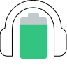

# 🎧 HyperX Battery & Mic Status for Stream Deck 🎮

A Stream Deck plugin that displays the battery level and microphone status of your HyperX Cloud Flight headset directly on your Stream Deck.

## ✨ Features

- 🔋 **Real-time battery monitoring** - See your headset's battery percentage at a glance
- 🎤 **Microphone status** - Instantly know if your mic is muted or active
- 🔌 **Connection status** - Visual indicator when your headset is disconnected
- 🎨 **Intuitive visuals** - Different icons for various battery levels and microphone states

## 📥 Installation

1. Download the latest release from the [GitHub repository](https://github.com/AlexAdiaconitei/HyperXBattery/releases)
2. Double-click the downloaded file to install it on your Stream Deck
3. Drag the Battery Status and/or Microphone Status actions to your desired keys

## 🎯 Usage

### Battery Status Action

This action displays your HyperX Cloud Flight's current battery level with both a visual icon and percentage text.

#### Battery States:

| State | Icon | Description |
|-------|------|-------------|
| Full |  | Battery level is 95% or higher |
| High |  | Battery level between 55% and 94% |
| Half |  | Battery level between 45% and 54% |
| Low |  | Battery level between 5% and 44% |
| Empty |  | Battery level below 5% |
| Disconnected |  | Headset is disconnected or powered off |

### Microphone Status Action

This action displays whether your headset's microphone is currently muted or active.

#### Microphone States:

| State | Icon | Description |
|-------|------|-------------|
| Unmuted |  | Microphone is active and transmitting audio |
| Muted |  | Microphone is muted |
| Disconnected |  | Headset is disconnected or powered off |

## 🔧 Technical Details

The plugin connects to your HyperX Cloud Flight headset through a custom service that monitors its status. Key technical components:

- Written in TypeScript using the Elgato Stream Deck SDK
- Uses a singleton pattern for the HyperX service to maintain a single connection
- Updates icons and text in real-time as events are received
- Properly cleans up resources when actions are no longer visible
- Uses [AlexAdiaconitei/hyperx-cloud-flight-wireless](https://github.com/AlexAdiaconitei/hyperx-cloud-flight-wireless) to connect to the device.

## ⚠️ Compatibility

**Currently only supports the HyperX Cloud Flight headset.** Support for additional HyperX models may be added in future updates.

## 🤝 Contributing

Contributions are welcome! If you have a HyperX headset model that isn't currently supported, you can help by:

1. Forking the repository
2. Adding support for your headset model
3. Submitting a pull request

## 📜 License

This project is licensed under the [MIT License](LICENSE)

## 📫 Support & Contact

If you encounter any issues or have questions:
- Open an issue on [GitHub](https://github.com/AlexAdiaconitei/HyperXBattery/issues)
- Contact me through GitHub

---

Made with ❤️ by [Alex Adiaconitei](https://github.com/AlexAdiaconitei)